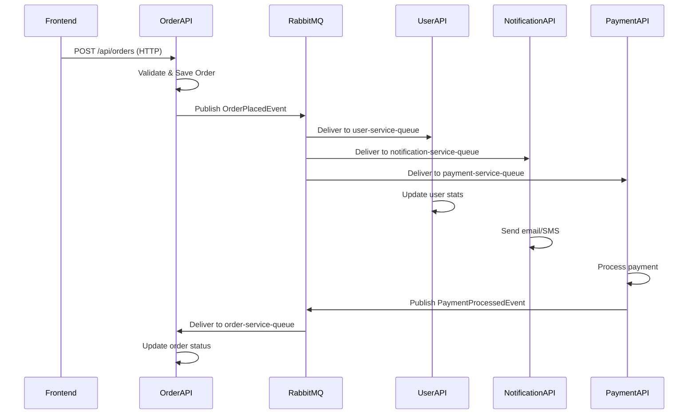

# RabbitMQ Multi-Service Architecture Guide

## Overview
This guide explains how to implement a distributed system with RabbitMQ messaging between multiple WebAPI services using Clean Architecture principles. Based on our previous conversation, we'll explore a system with 4 services (your original FogData API + 3 additional services) communicating asynchronously via RabbitMQ exchanges and queues.

## 🏗️ Architecture Overview

### System Components
```
[Frontend (React)]     [API A: Order Service]     [RabbitMQ Broker]
    ↓ HTTP                   ↓ Events/Commands           ↓
[API B: User Service] ←→ [Exchange: order-exchange] ←→ [Queues]
[API C: Notification Service]                        [API D: Payment Service]
```

### Clean Architecture Layers Per Service
Each WebAPI service follows Clean Architecture:
- **Presentation**: Controllers, DTOs, HTTP adapters
- **Application**: Use cases, commands, event handlers
- **Domain**: Entities, business rules, domain events
- **Infrastructure**: Repositories, messaging, external APIs

## 📨 Message Patterns

### 1. Commands (Request-Response)
**Purpose**: Direct service-to-service requests with optional response
- **Exchange Type**: Direct
- **Routing**: Specific queue (e.g., `payment.process-payment`)
- **Example**: Order Service → Payment Service: "Process Payment"

### 2. Events (Publish-Subscribe)
**Purpose**: Broadcast domain events to multiple consumers
- **Exchange Type**: Topic
- **Routing Keys**: `order.created`, `user.registered`, `payment.completed`
- **Example**: Order Service publishes `OrderPlacedEvent` → User, Notification, Payment services consume

## 🔄 Message Flow Examples

### Order Placement Flow


## 📦 Message Contracts

### Shared Contracts Project
Create a `Contracts` project for message definitions:

```csharp
// Contracts/Events/OrderPlacedEvent.cs
namespace Contracts.Events;

public record OrderPlacedEvent(
    Guid OrderId,
    Guid UserId,
    DateTimeOffset PlacedAt,
    decimal Total,
    IEnumerable<OrderItemDto> Items,
    Guid CorrelationId
);

public record OrderItemDto(
    Guid ProductId,
    int Quantity,
    decimal Price
);
```

### Commands Example
```csharp
// Contracts/Commands/ProcessPaymentCommand.cs
namespace Contracts.Commands;

public record ProcessPaymentCommand(
    Guid OrderId,
    Guid UserId,
    decimal Amount,
    string PaymentMethod,
    Guid CorrelationId
) : IRequest<PaymentResult>;

public record PaymentResult(
    bool Success,
    string? TransactionId,
    string? ErrorMessage
);
```

## 🛠️ Implementation with MassTransit

### Producer (Publishing Events)
```csharp
// Application/Services/IEventPublisher.cs
public interface IEventPublisher
{
    Task PublishAsync<T>(T message, Guid? correlationId = null) where T : class;
}

// Infrastructure/Messaging/EventPublisher.cs
public class EventPublisher : IEventPublisher
{
    private readonly IPublishEndpoint _publishEndpoint;

    public EventPublisher(IPublishEndpoint publishEndpoint)
    {
        _publishEndpoint = publishEndpoint;
    }

    public async Task PublishAsync<T>(T message, Guid? correlationId = null) where T : class
    {
        await _publishEndpoint.Publish(message, context =>
        {
            if (correlationId.HasValue)
                context.CorrelationId = correlationId.Value;
        });
    }
}
```

### Consumer (Handling Events)
```csharp
// Application/Handlers/OrderPlacedEventHandler.cs
public class OrderPlacedEventHandler : IConsumer<OrderPlacedEvent>
{
    private readonly IOrderService _orderService;
    private readonly ILogger<OrderPlacedEventHandler> _logger;

    public OrderPlacedEventHandler(IOrderService orderService, ILogger<OrderPlacedEventHandler> logger)
    {
        _orderService = orderService;
        _logger = logger;
    }

    public async Task Consume(ConsumeContext<OrderPlacedEvent> context)
    {
        var message = context.Message;
        var correlationId = context.CorrelationId ?? Guid.NewGuid();

        using (_logger.BeginScope(new Dictionary<string, object>
        {
            ["CorrelationId"] = correlationId,
            ["OrderId"] = message.OrderId
        }))
        {
            _logger.LogInformation("Processing OrderPlacedEvent for Order {OrderId}", message.OrderId);

            // Idempotency check
            if (await _orderService.WasEventProcessedAsync(context.MessageId.ToString()))
            {
                _logger.LogInformation("Event already processed");
                return;
            }

            try
            {
                await _orderService.HandleOrderPlacedAsync(message);
                await _orderService.MarkEventProcessedAsync(context.MessageId.ToString());
                _logger.LogInformation("OrderPlacedEvent processed successfully");
            }
            catch (Exception ex)
            {
                _logger.LogError(ex, "Failed to process OrderPlacedEvent");
                throw; // Let MassTransit handle retries/DLQ
            }
        }
    }
}
```

### MassTransit Configuration
```csharp
// Infrastructure/Extensions/MessagingExtensions.cs
public static class MessagingExtensions
{
    public static IServiceCollection AddMessaging(this IServiceCollection services, IConfiguration config)
    {
        services.AddMassTransit(x =>
        {
            // Register consumers
            x.AddConsumer<OrderPlacedEventHandler>();
            x.AddConsumer<PaymentProcessedEventHandler>();

            x.UsingRabbitMq((context, cfg) =>
            {
                cfg.Host(config["RabbitMq:Host"], h =>
                {
                    h.Username(config["RabbitMq:User"]);
                    h.Password(config["RabbitMq:Password"]);
                });

                // Order Service Consumer
                cfg.ReceiveEndpoint("order-service-events", e =>
                {
                    e.ConfigureConsumer<OrderPlacedEventHandler>(context);
                    e.UseMessageRetry(r => r.Exponential(5, TimeSpan.FromSeconds(1), TimeSpan.FromSeconds(30), TimeSpan.FromSeconds(2)));
                    e.UseInMemoryOutbox();
                });

                // User Service Consumer
                cfg.ReceiveEndpoint("user-service-events", e =>
                {
                    e.ConfigureConsumer<OrderPlacedEventHandler>(context);
                    e.Bind("order-exchange", s => {
                        s.RoutingKey = "order.*";
                        s.ExchangeType = ExchangeType.Topic;
                    });
                });

                // Configure exchanges
                cfg.Message<OrderPlacedEvent>(m => m.SetEntityName("order-exchange"));
                cfg.Publish<OrderPlacedEvent>(p => p.ExchangeType = ExchangeType.Topic);
            });
        });

        return services;
    }
}
```

## 🐳 Docker Compose Configuration

```yaml
version: '3.8'

services:
  rabbitmq:
    image: rabbitmq:3-management
    container_name: fogdata-rabbitmq
    ports:
      - "15672:15672"  # Management UI
      - "5672:5672"    # AMQP port
    environment:
      RABBITMQ_DEFAULT_USER: admin
      RABBITMQ_DEFAULT_PASS: password123
    volumes:
      - rabbitmq_data:/var/lib/rabbitmq
    networks:
      - fogdata-network
    healthcheck:
      test: ["CMD", "rabbitmq-diagnostics", "ping"]
      interval: 30s
      timeout: 10s
      retries: 5

  order-api:
    build:
      context: ./services/order-api
      dockerfile: Dockerfile
    container_name: fogdata-order-api
    ports:
      - "5001:8080"
    environment:
      - ASPNETCORE_ENVIRONMENT=Production
      - RabbitMq__Host=rabbitmq
      - RabbitMq__User=admin
      - RabbitMq__Password=password123
    depends_on:
      rabbitmq:
        condition: service_healthy
    networks:
      - fogdata-network

  user-api:
    build:
      context: ./services/user-api
      dockerfile: Dockerfile
    container_name: fogdata-user-api
    ports:
      - "5002:8080"
    environment:
      - ASPNETCORE_ENVIRONMENT=Production
      - RabbitMq__Host=rabbitmq
      - RabbitMq__User=admin
      - RabbitMq__Password=password123
    depends_on:
      rabbitmq:
        condition: service_healthy
    networks:
      - fogdata-network

  notification-api:
    build:
      context: ./services/notification-api
      dockerfile: Dockerfile
    container_name: fogdata-notification-api
    ports:
      - "5003:8080"
    environment:
      - ASPNETCORE_ENVIRONMENT=Production
      - RabbitMq__Host=rabbitmq
      - RabbitMq__User=admin
      - RabbitMq__Password=password123
    depends_on:
      rabbitmq:
        condition: service_healthy
    networks:
      - fogdata-network

  payment-api:
    build:
      context: ./services/payment-api
      dockerfile: Dockerfile
    container_name: fogdata-payment-api
    ports:
      - "5004:8080"
    environment:
      - ASPNETCORE_ENVIRONMENT=Production
      - RabbitMq__Host=rabbitmq
      - RabbitMq__User=admin
      - RabbitMq__Password=password123
    depends_on:
      rabbitmq:
        condition: service_healthy
    networks:
      - fogdata-network

networks:
  fogdata-network:
    driver: bridge

volumes:
  rabbitmq_data:
```

## 🛡️ Best Practices

### Idempotency
```csharp
public async Task<bool> WasEventProcessedAsync(string messageId)
{
    // Check Redis/DB for processed message IDs
    return await _cache.GetAsync($"processed:{messageId}") != null;
}

public async Task MarkEventProcessedAsync(string messageId)
{
    await _cache.SetAsync($"processed:{messageId}", "1", TimeSpan.FromDays(30));
}
```

### Correlation & Tracing
- Add `CorrelationId` to all messages
- Use OpenTelemetry for distributed tracing
- Propagate correlation IDs across service boundaries

### Error Handling
- Configure exponential backoff retries
- Use Dead Letter Queues for failed messages
- Implement circuit breakers for external services

### Monitoring
- Monitor queue depths and consumer lag
- Track message processing rates
- Set up alerts for DLQ messages

### Testing
```csharp
[Fact]
public async Task OrderPlacedEvent_PublishesCorrectly()
{
    // Arrange
    var harness = new InMemoryTestHarness();
    var consumerHarness = harness.Consumer<OrderPlacedEventHandler>();

    await harness.Start();

    // Act
    await harness.Bus.Publish(new OrderPlacedEvent(...));

    // Assert
    Assert.True(await consumerHarness.Consumed.Any());
}
```

## 🚀 Getting Started

1. **Create service projects** following Clean Architecture
2. **Add Contracts project** for shared message definitions
3. **Configure MassTransit** in each service
4. **Set up Docker Compose** with RabbitMQ
5. **Implement event handlers** and publishers
6. **Test locally** with RabbitMQ management UI

## 📚 Key Takeaways

- **Commands**: Direct, request-response communication
- **Events**: Broadcast, fire-and-forget communication
- **Clean Architecture**: Keeps messaging concerns in Infrastructure layer
- **MassTransit**: Simplifies RabbitMQ integration
- **Idempotency**: Critical for reliable message processing
- **Monitoring**: Essential for production reliability

This architecture scales from your current modular monolith to a full microservices system while maintaining clean separation of concerns.</content>
<parameter name="filePath">/Users/kutaybuyukkorukcu/Documents/Github/fogdata/FogData/RABBITMQ_MULTI_SERVICE_GUIDE.md